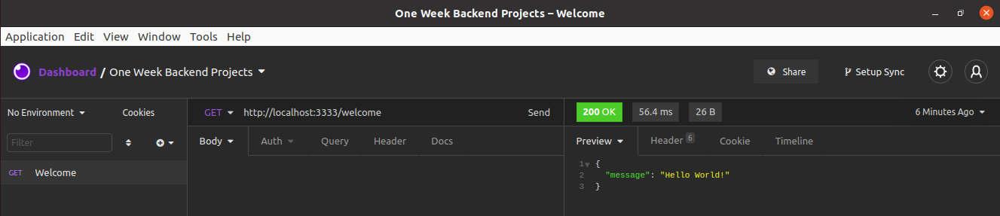

# #1 Hello World:  Minimum API


### **Problemática**
criar uma API que rode na porta 3333, que tenha a rota GET /welcome e retorne um status 200 e um JSON com a seguinte estrutura:

```json
{
	"message": "Hello World"
}
```
### **Screenshot**



### Starting
- instalando dependencias
    ```shell
    ./mvnw package
    ```
- inicializar aplicação
    ```shell
    ./mvnw spring-boot:run
    ```
- testar aplicação
    ```shell
    ./mvnw test
    ```